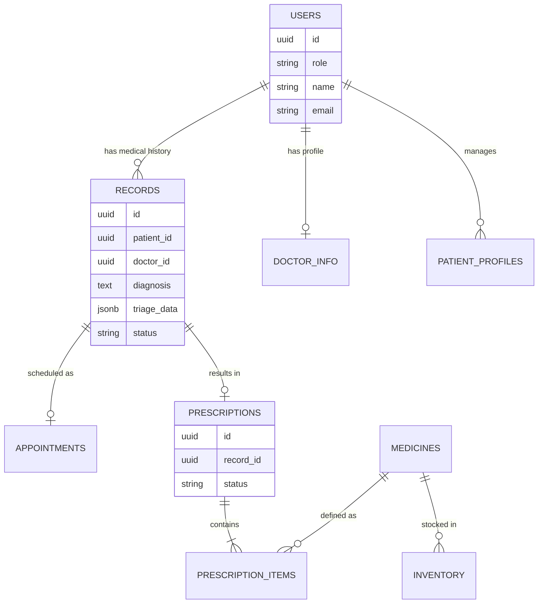

# Cấu Trúc & Cách Sử Dụng Cơ Sở Dữ Liệu MediHouse

Tài liệu này phác thảo sơ đồ cơ sở dữ liệu cho ứng dụng **MediHouse**, giải thích các bảng, mối quan hệ của chúng và cách chúng tương tác để hỗ trợ các tính năng của ứng dụng (đặt lịch, tư vấn, nhà thuốc, v.v.).

## 1. Tổng Quan
Cơ sở dữ liệu sử dụng **Supabase (PostgreSQL)**. Đây là cơ sở dữ liệu quan hệ xoay quanh bảng trung tâm `users`, với một số mô-đun chính:
*   **Người dùng cốt lõi**: `users`, `doctor_info`, `patient_profiles`
*   **Luồng lâm sàng**: `records` (hồ sơ y tế trung tâm), `appointments`
*   **Nhà thuốc**: `prescriptions`, `prescription_items`, `medicines`, `inventory`
*   **Hệ thống**: `notifications`, `messages`, `medical_services`

## 2. Chi Tiết Bảng & Mối Quan Hệ

### A. Quản Lý Người Dùng (`users`, `doctor_info`, `patient_profiles`)
*   **`users`**: Bảng trung tâm để xác thực. Lưu trữ thông tin đăng nhập cơ bản (`id`, `email`, `role`).
    *   **Vai trò (Roles)**: `patient` (bệnh nhân), `doctor` (bác sĩ), `pharmacy` (nhà thuốc), `admin` (quản trị viên).
*   **`doctor_info`**: Bảng mở rộng cho bác sĩ.
    *   Liên kết 1-1 với `users` qua `user_id`.
    *   Lưu trữ `specialty` (chuyên khoa), `bio` (tiểu sử), `experience_years` (số năm kinh nghiệm).
*   **`patient_profiles`**: Bảng mở rộng cho bệnh nhân.
    *   Liên kết 1-nhiều với `users` (một tài khoản có thể quản lý nhiều hồ sơ, ví dụ: cho thành viên gia đình).
    *   Lưu trữ `full_name` (họ tên), `dob` (ngày sinh), `address_*` (địa chỉ), `national_id` (CCCD).

### B. Hồ Sơ Lâm Sàng (`records`, `appointments`)
*   **`records`**: Trái tim của lịch sử y tế. Mỗi lần đặt lịch hoặc tư vấn đều tạo ra một "Record" (Hồ sơ).
    *   **Liên kết**: `patient_id`, `doctor_id`.
    *   **Các trường chính**:
        *   `symptoms`: Triệu chứng ban đầu.
        *   `diagnosis`: Chẩn đoán của bác sĩ.
        *   `notes`: Ghi chú nội bộ.
        *   `status`: `Pending` (Chờ) -> `Prescribed` (Đã kê đơn) -> `Completed` (Hoàn thành).
        *   **`triage_data` (JSONB)**: *Trường Quan Trọng*. Lưu trữ bản chụp chi tiết của bệnh nhân (Tên, Tuổi, Địa chỉ) tại thời điểm đặt lịch. Điều này đảm bảo rằng ngay cả khi hồ sơ chính thay đổi, hồ sơ y tế vẫn giữ thông tin bệnh nhân chính xác cho lần khám đó.
*   **`appointments`**: Thông tin lịch hẹn.
    *   **Liên kết**: `patient_id`, `doctor_id`, `record_id`.
    *   Lưu trữ `date` (ngày), `time_slot` (khung giờ), `status` (trạng thái).
    *   **Logic**: Khi bệnh nhân đặt lịch hẹn, cả `record` (cho thông tin y tế) và `appointment` (cho việc lên lịch) đều được tạo. Chúng được liên kết qua `record_id`.

### C. Mô-đun Nhà Thuốc (`prescriptions`, `medicines`, `inventory`)
*   **`prescriptions`**: Đơn thuốc do bác sĩ kê.
    *   **Liên kết**: thuộc về một `record_id`.
    *   **Trạng thái**: `Pending` (Mới) -> `Filled` (Nhà thuốc đã phát) -> `Completed`.
*   **`prescription_items`**: Các loại thuốc cụ thể trong đơn thuốc.
    *   **Liên kết**: `prescription_id`, `medicine_id`.
    *   Lưu trữ `quantity` (số lượng), `instructions` (hướng dẫn sử dụng).
*   **`medicines`**: Danh mục thuốc (`name`, `unit`, `active_ingredient`).
*   **`inventory`**: Quản lý kho.
    *   **Liên kết**: `medicine_id`.
    *   Lưu trữ `batch_number` (số lô), `quantity` (số lượng), `expiry_date` (hạn sử dụng).

## 3. Các Luồng Dữ Liệu Chính

### Kịch bản 1: Bệnh Nhân Đặt Lịch (Điểm Bắt Đầu)
1.  **Bệnh nhân** chọn dịch vụ/bác sĩ và thời gian trong ứng dụng.
2.  **Ứng dụng** tạo một dòng mới trong bảng **`records`**:
    *   `status` = 'Pending'
    *   `triage_data` = Bản chụp hồ sơ bệnh nhân đã chọn (Tên, Ngày sinh, v.v.).
    *   `symptoms` = Tên dịch vụ hoặc ghi chú ban đầu.
3.  **Ứng dụng** tạo một dòng trong bảng **`appointments`**:
    *   Liên kết với `record_id` mới.
    *   Thiết lập `date` và `time_slot`.

### Kịch bản 2: Bác Sĩ Tư Vấn
1.  **Bác sĩ** mở Bảng điều khiển (Dashboard). Truy vấn **`records`** khớp với `doctor_id`.
2.  Bác sĩ mở chi tiết hồ sơ.
    *   **Đọc**: Lấy thông tin bệnh nhân từ `triage_data` (hoặc dự phòng từ bảng `users`).
    *   **Cập nhật**: Bác sĩ nhập `diagnosis` (chẩn đoán) và `notes` (ghi chú) vào bảng **`records`**.
3.  **Kê đơn**:
    *   Bác sĩ thêm thuốc. Hành động này tạo một dòng **`prescriptions`** (liên kết với `record` hợp lệ) và nhiều dòng **`prescription_items`**.
    *   Trạng thái hồ sơ cập nhật thành `Prescribed`.

### Kịch bản 3: Nhà Thuốc Phát Thuốc
1.  **Dược sĩ** xem danh sách tất cả `prescriptions` có trạng thái 'Pending'.
2.  Dược sĩ xem chi tiết trong **`prescription_items`**.
3.  **Hành động Phát thuốc**:
    *   Cập nhật `inventory` (trừ số lượng kho).
    *   Cập nhật trạng thái `prescriptions` thành `Filled`.
    *   (Kích hoạt) Cập nhật trạng thái `records` cha thành `Completed`.
    *   (Kích hoạt) Cập nhật trạng thái `appointments` liên kết thành `Completed`.

## 4. Biểu Diễn Trực Quan Sơ Đồ Cơ Sở Dữ Liệu (Khái Niệm ER Diagram)

